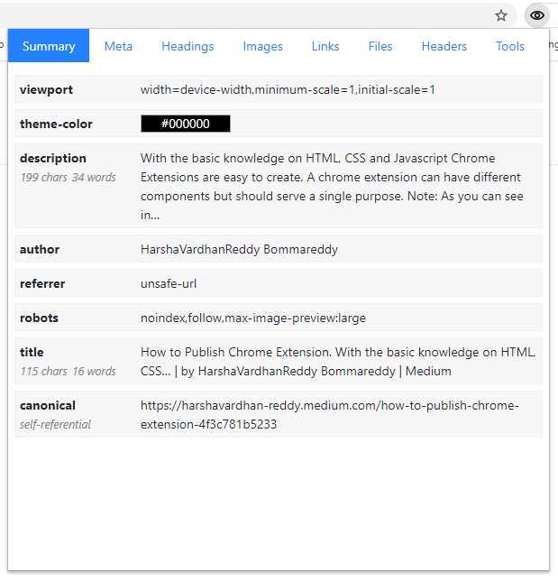

SEO Insights ist eine Chrome Extension um auf einen Blick die wichtigsten Informationen einer Website anzeigen zu können.

*Read this in other languages: [English](README.md), [Deutsch](README.de.md)*

### Funktionen

* Übersicht (Meta-Beschreibung, Titel, Canonical, usw.)
* Überschriften (inkl. Anzahl der Buchstaben und Wörter)
* Meta-Informationen (Open Graph, Facebook, Twitter, Dublin Core, Parse.ly, usw.)
* Bilder (Bildgröße, Alternativtext, Titel, Domains)
* Links (Protokolle, externe und interne Links, Preload und DNS Prefetch)
* Dateien (Stylesheets, JavaScript, spezielle Dateien)
* HTTP-Header-Informationen
* Links zu diversen Tools
  - [Google Page Speed Insights](https://developers.google.com/speed/pagespeed/insights/)
  - [W3C CSS Validation Service](https://jigsaw.w3.org/css-validator/)
  - [Nu Html Checker](https://validator.w3.org/nu/)
  - [GTmetrix](https://gtmetrix.com/)
  - [Test für Rich-Suchergebnisse](https://search.google.com/test/rich-results)
  - [Test auf Optimierung für Mobilgeräte](https://search.google.com/test/mobile-friendly)
* Mehrsprachigkeit: Englisch und Deutsch

### Verwendete Bibliotheken

* [jQuery 3.6.0](https://jquery.com/)
* [Bootstrap 4.6](https://getbootstrap.com/docs/4.6/getting-started/introduction/)

### Installation

#### Google Chrome / Microsoft  Edge

 1. Dieses Repository als [ZIP-Archiv bei GitHub herunterladen](https://github.com/SEO-Insights/seo-insights/archive/main.zip).
 2. Das ZIP-Archiv entpacken. Das Verzeichnis `seo-insights-main` sollte zur Verfügung stehen.
 3. Erweiterungen des Browsers öffnen:
    - Google Chrome: `chrome://extensions`
    - Microsoft Edge: `edge://extensions`
  4. Entwicklungsmodus aktivieren.
  5. Verzeichnis `seo-insights-main` als entpackte Erweiterung auswählen.